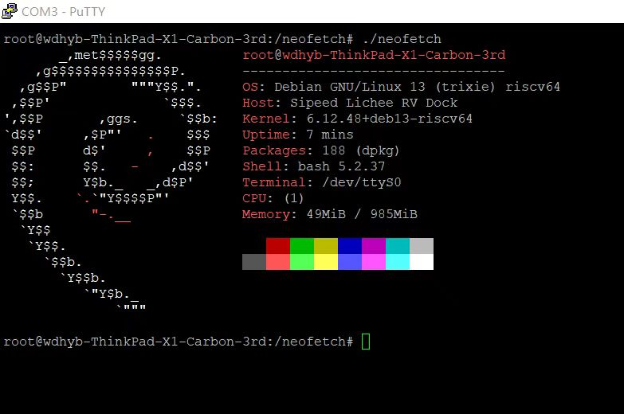

# Debian 13 D1 Test Report

## Test Environment

### Operating System Information

- System Version: Debian
- `sudo debootstrap --arch=riscv64 trixie rootfs http://deb.debian.org/debian`

### Hardware Information

- Sipeed Lichee RV Dock
- Power Adapter
- A microSD card
- A USB to UART Debugger

### Github Repo you need

* https://github.com/riscv-software-src/opensbi.git
* https://github.com/smaeul/u-boot.git
* https://github.com/jamesgraves/licheerv-debian-linux/blob/main/licheerv_linux_defconfig

### Required Package

* riscv64-linux-gnu-gcc
* debootstrap
* Hard Disk tools

## Test Criteria

Succeed：

Debian and shell running successfully

Failed:

No output

## Expected Results

Debian and shell running successfully

## Actual Results

Debian and shell running successfully

## Test Conclusion

Running successfully

## Specific Steps

### OpenSBI

Clone sourcecode from github

```
git clone https://github.com/riscv-software-src/opensbi.git
```

Compile

```
make CROSS_COMPILE=riscv64-linux-gnu- PLATFORM=generic FW_PIC=y -j$(nproc)
```

The file you just generated is at build/platform/generic/firmware/fw_dynamic.bin

### U-Boot

Clone sourcecode from this branch `d1-wip`

```
git clone https://github.com/smaeul/u-boot.git -b d1-wip
```

Configuration and compile

```
make lichee_rv_dock_defconfig

make CROSS_COMPILE=riscv64-linux-gnu- OPENSBI=../opensbi/build/platform/generic/firmware/fw_dynamic.bin -j$(nproc)
```

After that you get a `u-boot-sunxi-with-spl.bin` file

Later you'll need to copy that on your SD card

### Linux Kernel

First you need to copy kernel sourcecode from d1/all branch

Then you get the `config` file from another repo

```
git clone https://github.com/smaeul/linux.git -b d1/all

Here you need this  rv dock's `config` file：https://github.com/jamesgraves/licheerv-debian-linux/blob/main/licheerv_linux_defconfig
```

Configuration and compile

You get this Image file from `arch/riscv/boot/Image`

```
make ARCH=riscv licheerv_linux_defconfig

make ARCH=riscv CROSS_COMPILE=riscv64-linux-gnu- KCFLAGS='-fno-asynchronous-unwind-tables -fno-unwind-tables' -j$(nproc)

```

### extlinux.conf

This file contains some vital parameter for booting

You need to modify the rootfs's location if you need

```
Label Debian
	LINUX /Image
	APPEND root=/dev/mmcblk0p2 rw rootwait console=ttyS0,115200 earlycon=sbi
```

### rootfs

This part is the guide for building up rootfs

```
mkdir rootfs

sudo debootstrap --arch=riscv64 trixie rootfs http://deb.debian.org/debian
```

Then use `chroot` to do some jobs before actual running the system 

```
sudo chroot rootfs 

passwd 

apt update 

apt install ...

exit
```

### rootfs Image

1. Build a 1 GB image file
2. Copy rootfs to this image file

```
dd if=/dev/zero of=rootfs.img bs=1G count=1

sudo mkfs.ext4 rootfs.img

mkdir rootfs_mount

sudo mount rootfs.img rootfs_mount

sudo cp -rfp rootfs/* rootfs_mount

sudo umount rootfs_mount

rm -r rootfs_mount

sudo e2fsck -f rootfs.img

sudo resize2fs -M rootfs.img
```

### Flashing Image

First of all, you need to know where your SD card at: `sudo lsblk`

1. Set up your SD card with `sgdisk`

```
sudo sgdisk /dev/sdb -o 

sudo sgdisk /dev/sdb --new=1:4096:69631 --change-name=1:boot 

sudo sgdisk /dev/sdb --new=2:69632: --change-name=2:rootfs 

sudo sgdisk /dev/sdb -p
```

2. Put U-Boot on your SD card

```
sudo mkfs.vfat /dev/sdb1

sudo dd if=./u-boot/u-boot-sunxi-with-spl.bin of=/dev/sdb seek=256

sync
```

3. Copy kernel and extlinux.conf to the SD card

```
sudo mount /dev/sdb1 /mnt

sudo mkdir /mnt/extlinux

sudo cp ./linux/arch/riscv/boot/Image /mnt/

sudo cp ./extlinux.conf /mnt/extlinux/

sync

sudo umount /mnt
```

4. Flash rootfs to the card

```
sudo dd if=./rootfs.img of=/dev/sdb2 bs=4096

sync
```

### Starting Phase

1. Put SD card on the board
2. Connect it with your computer(via USB to UART debugger and `screen`)
3. Power on

### Verify system information

1. Login with root

then,

* `uname -a` 
* `cat /etc/os-release`
* `cat /proc/cpuinfo`

### neofetch




## Basic Info

### log 

```
root@wdhyb-ThinkPad-X1-Carbon-3rd:~# uname -a
Linux wdhyb-ThinkPad-X1-Carbon-3rd 6.1.0-rc3-443875-gb466df90d48f #1 PREEMPT Sat Oct  4 20:28:29 CST 2025 riscv64 GNU/Linux
root@wdhyb-ThinkPad-X1-Carbon-3rd:~# cat /etc/os-release
PRETTY_NAME="Debian GNU/Linux 13 (trixie)"
NAME="Debian GNU/Linux"
VERSION_ID="13"
VERSION="13 (trixie)"
VERSION_CODENAME=trixie
DEBIAN_VERSION_FULL=13.1
ID=debian
HOME_URL="https://www.debian.org/"
SUPPORT_URL="https://www.debian.org/support"
BUG_REPORT_URL="https://bugs.debian.org/"
root@wdhyb-ThinkPad-X1-Carbon-3rd:~# cat /proc/cpuinfo
processor       : 0
hart            : 0
isa             : rv64imafdc
mmu             : sv39
uarch           : thead,c906
mvendorid       : 0x5b7
marchid         : 0x0
mimpid          : 0x0
```


